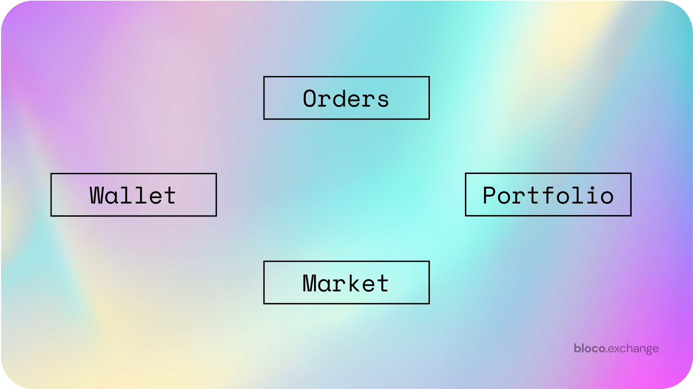

# Interactive Agents Documentation

Interactive agents on bloco.exchange are designed to provide users with a seamless and intuitive way to interact with the decentralized exchange (DEX) platform. They can perform a variety of tasks, from placing orders to retrieving market information, all through natural language communication.

This documentation focuses on the various ways users can interact with the interactive agents to perform specific tasks, providing additional examples and extensive explanations for each point.

## Orders

1. **Buy tokens/currencies across ETH and BSC.**
   
   You can purchase tokens or cryptocurrencies from Ethereum and Binance Smart Chain networks by specifying the amount and the token you wish to buy.
   Example: "Buy 100 dollars worth of Shiba token".
   Example: "Buy 5 BNB with my USDT".

2. **Sell tokens/currencies across ETH and BSC.**
   
   To sell tokens or cryptocurrencies, simply indicate the percentage or amount you want to sell and the token you're selling.
   Example: "Sell 30% of my LINK".
   Example: "Sell 500 GRT for USDC".

3. **Swap tokens/currencies across ETH and BSC.**
   
   You can swap tokens or cryptocurrencies between Ethereum and Binance Smart Chain networks by specifying the amount and the tokens you want to swap.
   Example: "Swap 50% of my FLOKI for PEPE".
   Example: "Swap 10 UNI for AAVE".

4. **Place limit orders for tokens/currencies across ETH and BSC.**
   
   Limit orders can be placed by specifying the token, amount, and the desired price or price change conditions.
   Example: "Buy 10 ADA when the price goes up by 10%".
   Example: "Sell 15 GRT when the price reaches 2.5 USDC".

## Wallet

1. **Make transfers.**
   
   You can send cryptocurrencies to other users or wallet addresses by specifying the amount and the recipient.
   Examples: "Send 1 ETH to John". "Send 2 BNB to 0x123123123123123123".

2. **Retrieve your addresses.**
   
   You can request your wallet addresses for different networks by asking the agent.
   Example: "What's my ETH address?"
   Example: "What's my BSC address?"

3. **Retrieve your username.**
   
   To find out your current username, simply ask the agent.
   Example: "What's my username?"

4. **Change your username.**
   
   You can change your username by providing a new one.
   Example: "Change my username to blocoKing"

5. **View your transactions.**
   
   To see your transaction history, ask the agent for the specific network or token.
   Example: "Show me my ETH transactions".
   Example: "Show me my transactions for AAVE".

## Portfolio

1. **Composition.**
   
   You can request information about your portfolio composition by asking the agent.
   Example: "Show my holdings".
   Example: "What's the value of my portfolio?"

2. **Performance.**
   
   To find out how your portfolio has performed over a specific period, ask the agent.
   Example: "How did my portfolio perform the past week?".
   Example: "What's my portfolio performance for the past month?"

3. **Recommendations.**
   
   The agent can provide portfolio optimization suggestions based on your preferences.
   Example: "Optimise my portfolio for lower risk".
   Example: "Suggest changes to improve my portfolio's performance".

## Market

1. **Charts.**
   
   To view the price chart of a specific token or cryptocurrency, ask the agent.
   Example: "Show me the chart for Dogecoin".
   Example: "Display the 1-month chart for Bitcoin".

2. **Price.**
   
   You can request the current price of a specific token or cryptocurrency.
   Example: "What's the price of Bitcoin?".
   Example: "How much is one AAVE worth?"

3. **Performance.**
   
   To find out the performance of a specific token or cryptocurrency over a certain period, ask the agent.
   Example: "How has Ethereum been doing the past week?"
   Example: "Show me the 30-day performance of Chainlink".

4. **Information.**
   
   The agent can provide information about specific tokens or cryptocurrencies, such as contract addresses and details about the project.
   Examples: "Tell me more about Sui". "What's the contract address for Galvan?"
   Examples: "What is the total supply of UNI?". "Who are the founders of Chainlink?"

5. **News.**
   
   To stay updated with the latest news and trends in the crypto market, ask the agent.
   Examples: "What's the latest crypto news?". "What's currently trending?".
   Examples: "Show me news about DeFi projects". "Are there any upcoming events for Polkadot?"

# Coming Soon

## Price Alerts

1. **Set price alerts.**
   
   You can set price alerts for specific tokens or cryptocurrencies to be notified when the price reaches your desired target.
   Example: "Alert me when Bitcoin reaches $60,000".
   Example: "Notify me when Chainlink drops below $25".

2. **Manage price alerts.**
   
   You can view, modify, or delete your existing price alerts.
   Examples: "Show me my price alerts". "Change my Bitcoin alert to $55,000". "Remove my Ethereum alert".

## Trading Tools

1. **Technical Analysis.**
   
   The agent can provide you with technical analysis for specific tokens or cryptocurrencies, such as moving averages, RSI, or MACD.
   Example: "Show me the RSI for Bitcoin".
   Example: "What's the 50-day moving average for Ethereum?"

2. **Trading Strategies.**
   
   The agent can suggest trading strategies based on your risk profile and trading goals.
   Examples: "Suggest a low-risk trading strategy". "What's a good short-term trading strategy for DeFi tokens?"

## Staking and Farming

1. **Staking.**
   
   You can interact with the agent to stake your tokens or cryptocurrencies and learn about the rewards and APYs.
   Examples: "Stake 100 AAVE tokens". "What's the APY for staking UNI?"

2. **Farming.**
   
   The agent can guide you through the process of yield farming, providing information about available pools and potential returns.
   Examples: "Start yield farming with my SUSHI tokens". "What are the best farming pools for BSC?"

## NFTs (Non-Fungible Tokens)

1. **Browse and Search NFTs.**

   You can explore and search for NFTs across various marketplaces and collections.
   Examples: "Show me CryptoPunks collection". "Search for Bored Ape Yacht Club NFTs".

2. **NFT Details.**

   The agent can provide information about specific NFTs, such as metadata, rarity, and ownership.
   Examples: "Tell me more about CryptoPunk #7804". "Who owns Bored Ape #1729?"

3. **Buy, Sell, and Trade NFTs.**

   You can buy, sell, or trade NFTs on supported marketplaces through the agent.
   Examples: "Buy CryptoPunk #6042". "Sell my Bored Ape #5123". "Trade my CryptoKitty for a World of Women NFT".

4. **Create and Mint NFTs.**

   The agent can guide you through the process of creating and minting your own NFTs.
   Examples: "Create an NFT from my artwork". "Mint a new NFT for my music track".

5. **Manage Your NFT Portfolio.**

   You can view and manage your NFT holdings through the agent.
   Examples: "Show me my NFT collection". "How much is my NFT portfolio worth?"

6. **NFT Auctions and Bidding.**

   The agent can assist you with participating in NFT auctions and bidding on desired items.
   Examples: "Bid 10 ETH on CryptoPunk #6923". "Show me the current bids on Bored Ape #1234".

## Social Networking Functionality

1. **Sending Messages.**

   You can send messages to your friends or other platform users through the interactive agent.
   Examples: "Send a message to Alice saying 'Great trade on BTC!'".
              "Ask John if he's interested in joining the DeFi webinar tomorrow".

2. **Create and Manage Groups.**

   The agent can help you create and manage groups for discussing various crypto topics or sharing trading ideas with friends.
   Examples: "Create a group called 'NFT Enthusiasts' and invite Alice, Bob, and Charlie".
              "Add John to my 'DeFi Traders' group". "Remove Alice from the 'Crypto Investors' group".

3. **Post on Social Feeds.**

   Share your thoughts, ideas, or news with your network by posting on social feeds through the interactive agent.
   Examples: "Post on my feed: 'Just bought some more LINK, the future looks promising!'".
              "Share the latest Ethereum news on my feed".

4. **Interact with Posts.**

   The agent can help you engage with posts from your network by liking, commenting, or sharing content.
   Examples: "Like Alice's recent post on NFTs".
              "Comment on Bob's post: 'Great analysis on the DeFi market!'".
              "Share Charlie's post about the upcoming crypto conference".

5. **Event Organization and Invitations.**

   Organize events, webinars, or meetups for your network and send invitations through the interactive agent.
   Examples: "Create an event for 'Crypto Trading Strategies' next Tuesday at 6 pm and invite my 'DeFi Traders' group".
              "RSVP to the 'NFT Art Showcase' event and invite Alice".

## Additional Functionality

1. **Leveraged Trading.**

   The interactive agent can assist users with setting up and managing leveraged trades for supported tokens or cryptocurrencies.
   Examples: "Open a 3x long position on Bitcoin". "Close my 5x short position on Ethereum".

2. **Options Trading.**

   Users can explore options trading strategies, like buying or selling calls and puts, with the help of the interactive agent.
   Examples: "Buy a call option for Bitcoin with a $60,000 strike price expiring in 30 days".
              "Sell a put option for Ethereum with a $3,000 strike price expiring in 7 days".

3. **Token Launches and ICOs.**

   The agent can keep users updated on upcoming token launches, Initial Coin Offerings (ICOs), and Initial DEX Offerings (IDOs), and assist with participation.
   Examples: "Show me upcoming token launches". "How do I participate in the XYZ token ICO?".

4. **Risk Management.**

   The interactive agent can help users set up and manage stop-loss and take-profit orders to minimize risk and lock in gains.
   Examples: "Set a stop-loss order for my Bitcoin position at $55,000". "Set a take-profit order for my Ethereum position at $4,000".

5. **Advanced Trading Algorithms.**

   The agent can help users set up and manage advanced trading algorithms, such as Dollar-Cost Averaging (DCA), moving average crossovers, or market-making strategies.
   Examples: "Set up a DCA strategy for buying Bitcoin weekly". "Create a moving average crossover strategy for Ethereum".

6. **Educational Resources.**

   The interactive agent can provide users with educational resources on various crypto and blockchain topics, including tutorials, articles, and videos.
   Examples: "Show me a tutorial on how to set up a crypto wallet". "Find articles about DeFi lending platforms".

7. **Crypto Lending and Borrowing.**

   Users can explore lending and borrowing opportunities on various platforms with the help of the interactive agent.
   Examples: "Lend 100 USDC on Aave". "Borrow 50 DAI using my ETH as collateral on Compound".

8. **Integration with External Tools.**

   The agent can integrate with external tools like TradingView for advanced charting, technical analysis, or collaboration with other traders.
   Examples: "Show me the TradingView chart for Bitcoin". "Find a trading script for RSI divergence on TradingView".

To use these additional functionalities, communicate with your interactive agent in natural language, as demonstrated in the examples above. The agent will understand your request and perform the corresponding task accordingly.
