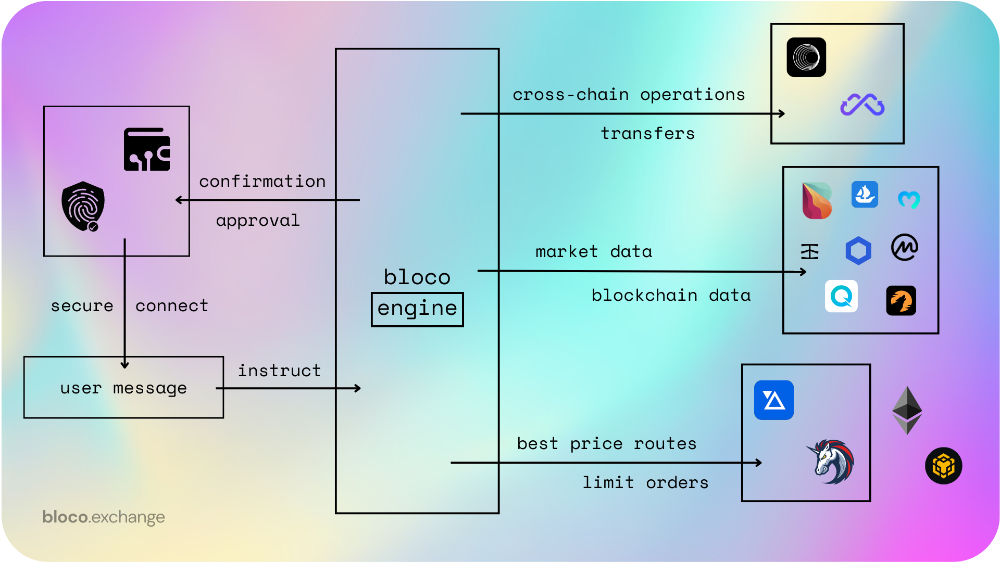

# Integrations Overview

Bloco.exchange is a powerful, AI-powered web3 platform that enables users to trade, invest, and manage their digital assets with ease. To provide users with the best possible experience and access to a wide range of opportunities, bloco.exchange integrates various third-party technologies and protocols.

In this overview, we will discuss the key integrations within the bloco.exchange platform:

## 1. 1inch Integration

1inch is a decentralized exchange aggregator that sources liquidity from various exchanges to provide users with the best possible rates. Bloco.exchange integrates 1inch to offer users access to optimal trading rates and seamless token swaps.

By leveraging 1inch's smart routing algorithm, bloco.exchange ensures users receive the best possible rates when executing trades. Users can also place limit orders and interact with the platform using natural language.

For more information about the 1inch integration, please see the [1inch Integration](1inch_integration.md) documentation.

## 2. Wormhole Integration

Wormhole is a decentralized, bidirectional, multi-chain bridge that connects various blockchain networks, such as Ethereum, Binance Smart Chain, Solana, and others. Bloco.exchange integrates Wormhole to enable users to transfer assets seamlessly across different chains.

By supporting cross-chain asset transfers, bloco.exchange expands the trading and investment opportunities available on the platform. Users can perform cross-chain transactions within the intuitive, AI-powered interface without the need for multiple wallets or external tools.

For more information about the Wormhole integration, please see the [Wormhole Integration](wormhole_integration.md) documentation.

## 3. ParaSwap Integration

ParaSwap is a decentralized exchange aggregator that optimizes token swaps by pooling liquidity from various sources. Bloco.exchange integrates ParaSwap to offer users a more comprehensive selection of trading options and the most competitive rates.

The ParaSwap integration enhances bloco.exchange's trading capabilities, allowing users to benefit from the best prices across multiple liquidity sources. Users can access the aggregated liquidity and swap tokens effortlessly within the bloco.exchange interface.

For more information about the ParaSwap integration, please see the [ParaSwap Integration](paraswap_integration.md) documentation.

## 4. MultiChain Integration

MultiChain is a blockchain technology that enables the creation of private and permissioned blockchain networks. By integrating MultiChain, bloco.exchange expands its support for various blockchain networks, offering users a more diverse range of trading and investment options.

The MultiChain integration ensures that bloco.exchange remains interoperable with multiple blockchain networks, providing users with a seamless and versatile platform for managing their digital assets.

For more information about the MultiChain integration, please see the [MultiChain Integration](multichain_integration.md) documentation.

## 5. Bitquery Integration

Bitquery is a comprehensive suite of blockchain data and analytics tools that provide valuable insights into various blockchain networks. Bloco.exchange integrates Bitquery to offer users real-time data and market analytics to make informed decisions.

The Bitquery integration equips users with powerful analytics tools, enabling them to monitor market trends, track transactions, and analyze various blockchain networks. This valuable information helps users make better-informed trading and investment decisions within the bloco.exchange platform.

For more information about the Bitquery integration, please see the [Bitquery Integration](bitquery_integration.md) documentation.

## 6. OpenSea Integration

OpenSea is the largest decentralized marketplace for NFTs (non-fungible tokens), offering a vast selection of unique digital assets. Bloco.exchange integrates OpenSea to provide users with access to a wide range of NFTs for trading and investment purposes.

By integrating OpenSea, bloco.exchange expands its support for digital assets beyond cryptocurrencies, allowing users to trade and invest in unique and rare NFTs within the platform. Users can browse, purchase, and sell NFTs directly on bloco.exchange, simplifying the process of engaging with the growing NFT market.

For more information about the OpenSea integration, please see the [OpenSea Integration](opensea_integration.md) documentation.

## 7. Chainlink Integration

Chainlink is a decentralized oracle network that provides secure and reliable data feeds to smart contracts on various blockchain networks. Bloco.exchange integrates Chainlink to ensure that the platform's trading, investing, and asset management features function with accurate and up-to-date information.

The Chainlink integration enables bloco.exchange to obtain reliable and tamper-proof data feeds for various assets, ensuring that users can make informed decisions based on accurate information. This integration enhances the platform's overall security and reliability.

For more information about the Chainlink integration, please see the [Chainlink Integration](chainlink_integration.md) documentation.

## Stay Informed

Bloco.exchange's integrations with 1inch, Wormhole, ParaSwap, MultiChain, Bitquery, OpenSea, Chainlink, and others equip users with a comprehensive, versatile, and user-friendly platform to manage their digital assets. These integrations expand the trading and investment opportunities available on the platform and help to break barriers in the world of decentralized finance.

Keep an eye on this overview, as we will continue to update it with new integrations and features to elevate the bloco.exchange experience.

For an overview of bloco.exchange please see the [Overview](../overview.md).

