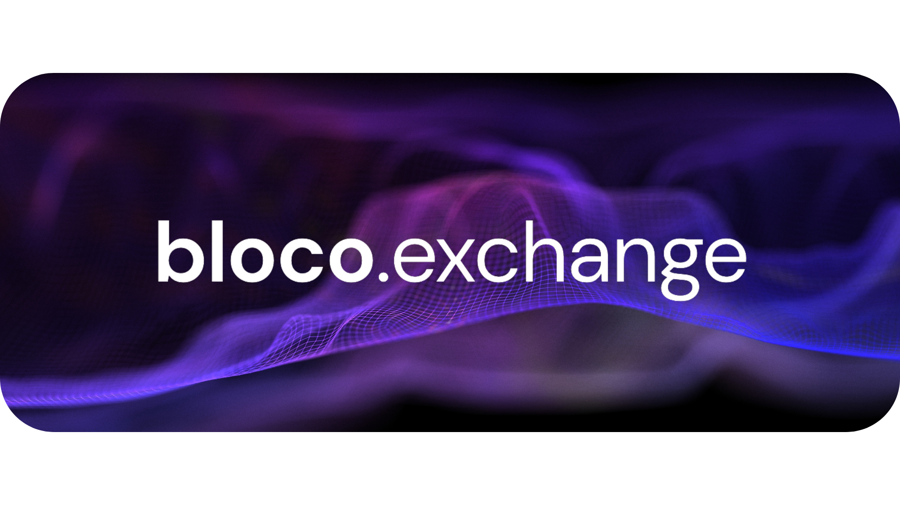
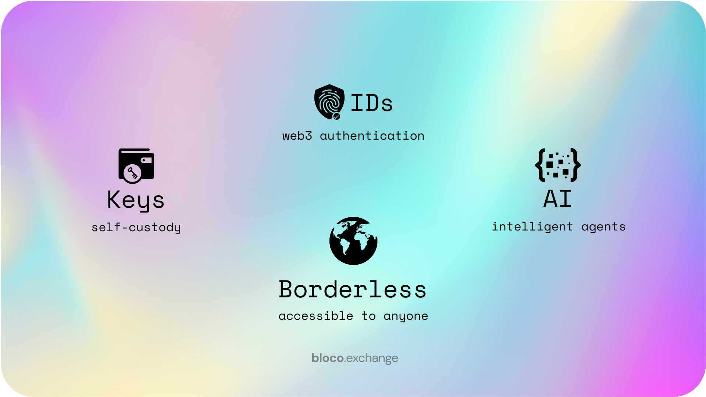

# Reimagining Web3 Interactions

bloco.exchange is an AI-powered web3 platform that seamlessly blends cutting-edge technology with the simplicity of natural language to reimagine the way users trade, invest, and manage their digital assets. With intuitive tools and interactive agents, bloco.exchange empowers its users to navigate the complex financial landscape with confidence and ease.

## The Power of bloco.exchange

Our platform offers an unparalleled suite of features designed to elevate your experience and provide you with the best possible opportunities:

1. **Dedicated Intelligent Agents**: Imagine having a personal concierge for your digital assets. bloco.exchange pairs every user with their own intelligent agent that can act on their behalf, guiding them through markets, executing trades, managing investments, and providing essential market insights for well-informed decision-making.

2. **Custody and Authorization**: At bloco.exchange, we believe in the power of autonomy and security. We ensure that keys and funds remain in the hands of their rightful owners, giving our users complete control over their digital assets.

3. **Identification and Authentication**: By employing Web3 technology for user login, bloco.exchange places the utmost importance on privacy and security, safeguarding your data and digital identity.

4. **Borderless Access**: We've torn down the barriers that once separated us, creating a truly global platform accessible to anyone, anywhere. With bloco.exchange, users can trade, invest, and engage in commerce without the constraints of borders or boundaries.

Welcome to bloco.exchange, where the future of digital asset management comes alive.

## Membership Tiers: Choose Your Path to Success

bloco.exchange presents two distinct membership tiers, designed to cater to the unique needs and aspirations of our users:

- **Essential**: Embrace the foundational elements of bloco.exchange with the Essential tier, granting you access to our platform's core features and functionalities. This tier is perfect for those looking to explore and grow in the world of digital assets.

- **Elite**: Elevate your experience to new heights with the Elite tier, unlocking a realm of premium features, exclusive benefits, and unparalleled opportunities tailored for those who strive for excellence in their digital asset journey.

Embark on the path that aligns with your vision and goals, and let bloco.exchange be the catalyst for your success.

## Diverse DeFi Protocols and Integrations for an Inclusive Financial Ecosystem

At bloco.exchange, we believe in the power of diversity and inclusion to foster innovation and create a truly revolutionary financial ecosystem. To that end, we have meticulously curated and integrated a wide range of DeFi protocols and third-party technologies, each bringing their unique strengths to the table:

- [1inch Integration](integrations/1inch_integration.md): We've integrated 1inch, a leading decentralized exchange aggregator, to deliver the most competitive trading rates and frictionless token swaps by tapping into multiple liquidity sources.

- [Wormhole Integration](integrations/wormhole_integration.md): Wormhole, a pioneering multi-chain bridge, connects disparate blockchain networks like Ethereum, Binance Smart Chain, Solana, and more. Our integration with Wormhole allows users to transfer assets effortlessly across different chains, breaking down barriers and fostering interconnectedness.

- [ParaSwap Integration](integrations/paraswap_integration.md): With ParaSwap, another reputable decentralized exchange aggregator, bloco.exchange offers a broader spectrum of trading possibilities and the most advantageous rates, further enriching our users' trading experience.

- [MultiChain Integration](integrations/multichain_integration.md): By integrating MultiChain, a versatile blockchain technology, bloco.exchange broadens its support for a diverse array of blockchain networks, providing our users with a rich variety of trading and investment opportunities to explore.

- [Bitquery Integration](integrations/bitquery_integration.md): Bitquery, a comprehensive suite of blockchain data and analytics tools, enables us to equip our users with real-time data and market analytics, empowering them to make well-informed decisions in a fast-paced financial landscape.

- [OpenSea Integration](integrations/opensea_integration.md): As the largest decentralized marketplace for NFTs (non-fungible tokens), OpenSea offers a treasure trove of unique digital assets. Our integration with OpenSea grants our users access to a vast universe of NFTs for trading and investment, sparking creativity and new possibilities.

- [Chainlink Integration](integrations/chainlink_integration.md): Chainlink, a decentralized oracle network, supplies accurate and up-to-date data feeds to smart contracts on a variety of blockchain networks. By integrating Chainlink, we ensure that bloco.exchange's trading, investing, and asset management features are underpinned by reliable and secure information.

Together, these diverse integrations coalesce into a harmonious whole, creating an inclusive, versatile, and powerful financial ecosystem that caters to the unique needs and aspirations of our users.

## The bloco.exchange Experience: Engage, Compete, and Prosper

At bloco.exchange, we believe that success is best savored when shared. That's why we've designed an [interactive, reward-driven experience](gamification/gamification.md) to inspire our users, foster camaraderie, and celebrate achievements:

- **Leaderboards**: Ascend the ranks and showcase your prowess on our dynamic leaderboards. By ranking users based on their platform activity, we encourage a spirited atmosphere of friendly competition and collaboration.

- **Achievement Bonuses**: Transform your passion into profit as you earn points for every action, trade, or activity you complete on our platform through Achievement Bonuses. Accumulate these points and convert them into monetary value, reaping the rewards of your dedication and enthusiasm.

- **Bloco Ambassadors**: Share the magic of bloco.exchange with others and enjoy the fruits of their success through our Bloco Ambassadors program. For every new user you refer, you'll receive a percentage of their subscription fee, creating a continuous stream of income that grows alongside your network.

Embrace the thrill of engagement, revel in the excitement of competition, and flourish in a world of boundless opportunities at bloco.exchange.

## Native Currency and Dividends: Unleash the Power of Blocs (⨖)

bloco.exchange is fueled by its native currency, [blocs (⨖)](blocs/overview.md), designed to reward and empower our users. Our innovative dividend structure distributes various cashflows to investors, token listings, and holders, creating a thriving and dynamic ecosystem:

- **Dividend Boosters**: Ignite your earnings with Dividend Boosters, which temporarily amplify the dividend yield for users engaging in specific platform activities, such as providing liquidity, referring new users, or participating in governance decisions. Boosters foster user engagement and propel platform growth.

- **Dividend-Linked NFTs**: Unlock extraordinary dividend privileges with Dividend-Linked NFTs, which grant holders unique benefits such as increased dividend payouts, exclusive access to high-yield pools, or early access to new dividend-generating opportunities. Trade, stake, or use these NFTs as collateral to harness the full potential of our native ERC20 token (⨖).

- **Tokenized Dividend Rights**: Experience unprecedented liquidity and flexibility with Tokenized Dividend Rights, which represent a claim on a portion of the platform's future dividend payouts. Users can trade these rights in a secondary market, providing an extra layer of adaptability for managing dividend income.

## Future Innovations

bloco.exchange is committed to continuous innovation and expansion, with several exciting developments planned for the future:

- **Decentralized Autonomous Index Fund (DAIF)**: DAIFs are smart-contract-based funds that are managed by a investor consensus, rather than a centralized entity. These funds invest in a diversified portfolio of assets, including cryptocurrencies, stocks, and commodities, and use blockchain technology to automate the management and rebalancing of the portfolio.

- **Blocs (⨖) Payment Gateway**: bloco.exchange plans to develop a Blocs (⨖) Payment Gateway for e-commerce platforms, allowing merchants to accept Blocs (⨖) as payment for goods and services, and driving real-world adoption and utility.

## Documentation and Resources

To further assist users in understanding and utilizing bloco.exchange's features and integrations, the platform provides comprehensive documentation and resources:

- [Getting Started Guide](getting_started.md): A step-by-step guide to help new users set up their accounts, understand the platform's features, and begin trading and investing.

- [Smart Contract Documentation](smart_contract_documentation.md): In-depth information on the smart contracts used by bloco.exchange, including their functions, features, and interactions with the platform.

- [API Documentation](api_documentation.md): Detailed information on bloco.exchange's API, including usage, authentication, endpoints, and examples.

- [Integration Guides](integrations/overview.md): A collection of guides and resources to help users understand and utilize the various DeFi protocols and third-party integrations available on bloco.exchange.

- [Troubleshooting and Support](troubleshooting_and_support.md): Assistance for users experiencing issues with the platform, including common problems, solutions, and contact information for support.

- [FAQs](faqs.md): A comprehensive list of frequently asked questions and answers to help users quickly find information and solutions related to the platform.

bloco.exchange is committed to delivering a world-class trading and investment experience, leveraging advanced technologies and innovative features to empower users and unlock new possibilities in the world of digital assets.

## Community and Governance

- [Governance Proposals](governance_proposals.md): Information on how users can participate in the governance of the platform by submitting proposals, discussing potential changes, and voting on decisions that affect the future of bloco.exchange.

- [Events and Webinars](events_and_webinars.md): A calendar of upcoming events, webinars, and meetups where users can learn about the latest developments, network with other users, and engage with the bloco.exchange team.

- [Development Roadmap](development_roadmap.md): An overview of bloco.exchange's development plans, milestones, and future features, allowing users to stay informed about the platform's progress and upcoming enhancements.

By providing a comprehensive set of resources and fostering a strong sense of community, bloco.exchange aims to continuously improve its platform and empower users to make the most of their digital assets. Your feedback and suggestions are invaluable as we work together to shape the future of decentralized finance.

## A Personal Note from the Team: Together, We Forge a New Frontier

From all of us at the bloco.exchange team, we'd like to extend our heartfelt gratitude for your interest in our platform. Our driving mission is to create an accessible, intelligent, and peer-to-peer platform for the world of digital finance. Your unwavering support and invaluable feedback are instrumental in helping us realize this vision.

As we continually innovate and elevate our platform, our commitment to prioritizing the needs of our users remains steadfast. We believe that, united, we can forge a more inclusive and empowering financial landscape.

We are always eager to hear your suggestions, address your questions, and alleviate your concerns. Please don't hesitate to connect with us through our various communication channels. Your insights are invaluable, and we are eager to grow and evolve alongside you.

Once more, thank you for being an integral part of the bloco community. We are filled with anticipation for the future and the boundless opportunities that await us all.

Wishing you success and prosperity on this shared journey,

**Godspeed**

